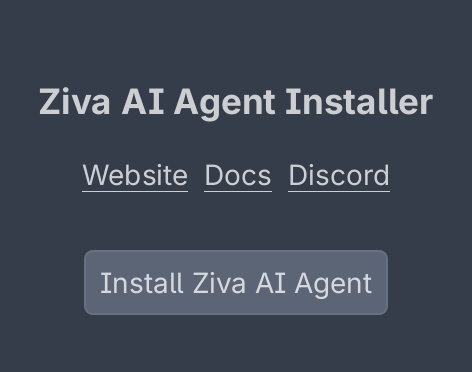

# Ziva AI Agent Installer

This is a Godot plugin that installs [Ziva](https://ziva.sh), an AI agent for Godot. It's designed for ease of integration with the [Godot Asset Library](https://godotengine.org/asset-library/asset). While you can download Ziva with this plugin, it's recommended to get Ziva from https://ziva.sh/download

### Installation

1. Open Godot

2. Click on the AssetLib tab

3. Search for `Ziva Installer`

4. Click it and click `Download`

5. You should see the installer Dock on the left side

6. Click on `Install Ziva AI Agent`

Note: If Ziva AI Agent is already installed (res://addons/ziva_agent) the installer dock will not appear.

For any help join the discord server: [Ziva Discord](https://ziva.sh/discord)